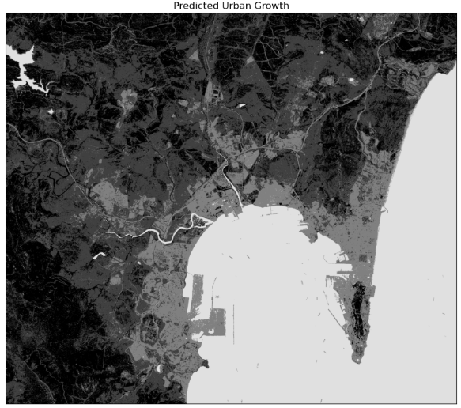
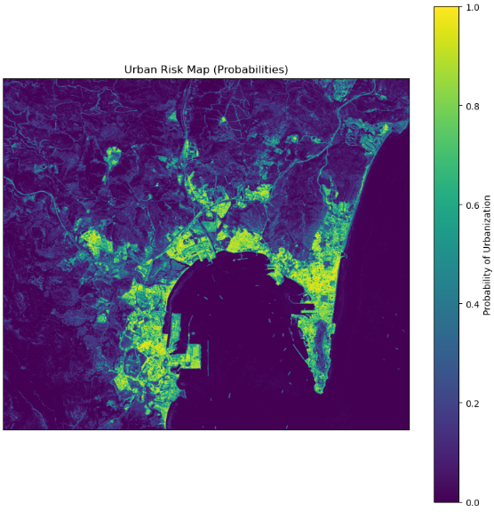

# Urban Growth Prediction using Machine Learning

## Author
**Mikre Getu Mihrete**  
BSc in Computer Science and MSc in Information Systems  
Debre Berhan University, Ethiopia

## Project Overview
This project uses a Random Forest model on Sentinel-2 imagery to predict urban expansion in Bilbao, Spain. It achieved over 90% accuracy, producing a land cover map and a crucial "Urban Risk Map" to inform sustainable urban planning. This work directly supports SDG 11 (Sustainable Cities and Communities) and SDG 13 (Climate Action).

This capstone project's objective is to develop and evaluate a machine learning model for monitoring urban growth from satellite imagery. By analyzing multispectral data, the project provides crucial information for urban planners, helping them manage sprawl and support sustainable development. The primary output, a probabilistic "Urban Risk Map," identifies areas most susceptible to future urbanization.

## Study Area
The analysis focuses on Bilbao, Spain, a major industrial city in the Basque Country. Its diverse coastal-urban landscape, including the Port of Bilbao and the Nervión River, presents an ideal environment for testing the land cover classification model.

## Methodology
The project's core is a supervised classification workflow using a Random Forest Classifier.

## Data and Preprocessing
- **Data Source:** The model uses Sentinel-2 satellite imagery for its high spatial and temporal resolution.

- **Preprocessing:** The workflow involved reshaping the raster data, filtering invalid pixels, and splitting the dataset into 80% for training and 20% for validation. A batch processing approach was implemented to handle large raster files and prevent memory errors.

## Outputs
The model generates two key visual outputs:

- **Predicted Urban Growth:** A discrete land cover classification map.
  
- **Urban Risk Map:** A probabilistic map that shows the likelihood of each pixel being an urban area.

## Results and Evaluation
The Random Forest model demonstrated strong performance with an overall accuracy of 90.08%. It was particularly effective at identifying urban areas, achieving a near-perfect F1-score of 0.99 for the "Urban" class. However, the model struggled with minority classes like "Cropland" and "Cloud/Shadow" due to class imbalance.

## Challenges and Future Work
To improve the model's robustness, future work should focus on:

- **Addressing Class Imbalance:** Use techniques like SMOTE or class weighting to improve performance on underrepresented land cover types.

- **Feature Engineering:** Incorporate additional spectral indices, such as NDVI and NDBI, to better differentiate between spectrally similar classes like vegetation and urban areas.

- **Exploring Advanced Models:** Investigate more sophisticated machine learning techniques, such as Convolutional Neural Networks (CNNs), to capture more complex spatial-spectral patterns.

- **Temporal Analysis:** Apply the model to a time-series of imagery to analyze urban growth dynamics over time.
